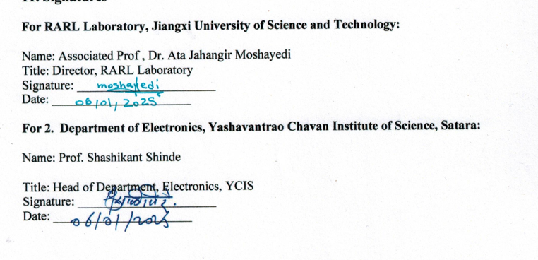

On January 6, 2025, a significant collaboration agreement was formalized between the RARL Laboratory at Jiangxi University of Science and Technology and the Department of Electronics at Yashavantrao Chavan Institute of Science, Satara, India. This agreement aims to enhance research and academic partnerships, promoting innovation, facilitating knowledge exchange, and fostering joint research initiatives between the two institutions.

The list of support to be shared are as follows:

1. Research/ Study and guidance in the Field of Robotic and Automation.
2. Publication of joint research findings in peer-reviewed journals and conferences.
3. Students, faculty exchange and write proposals to absorb the funds.
4. Student Guidance for PhD and postgraduate level.

