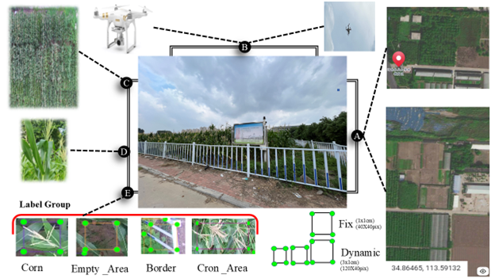
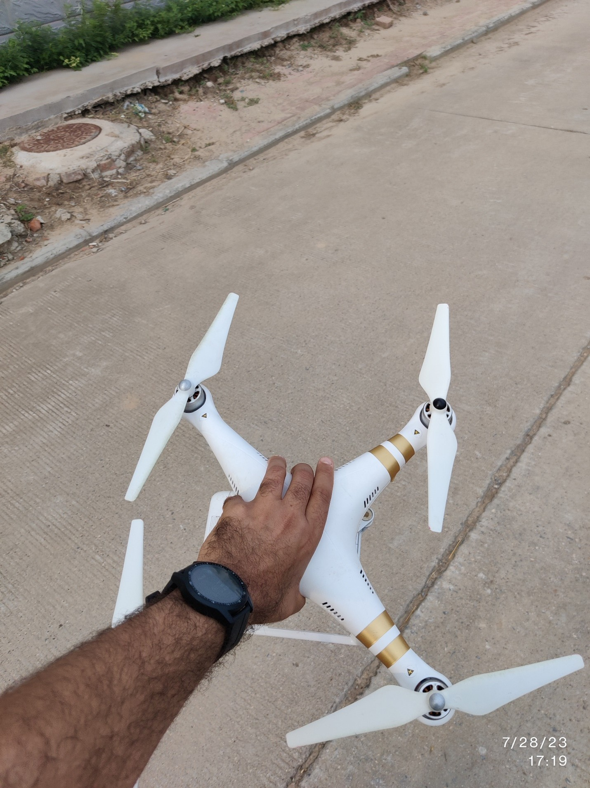
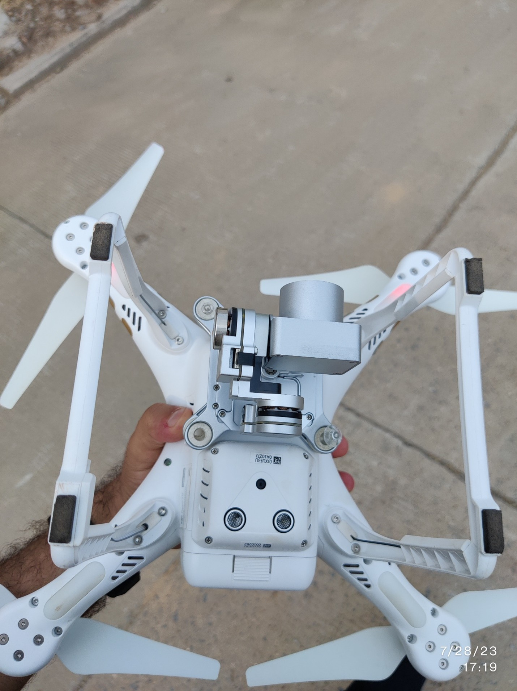
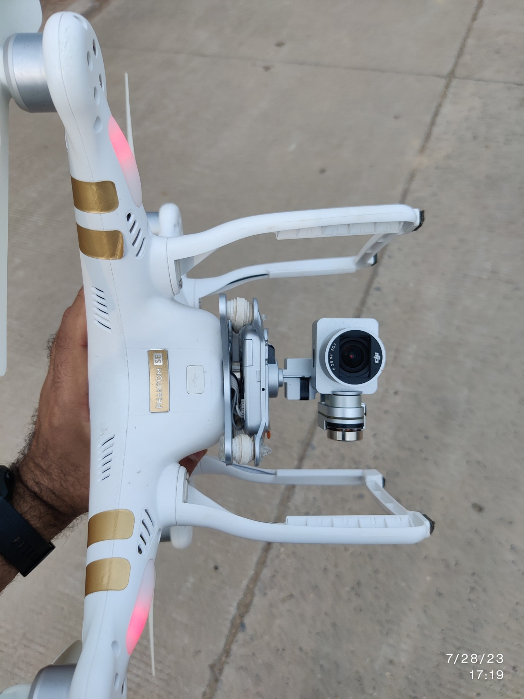
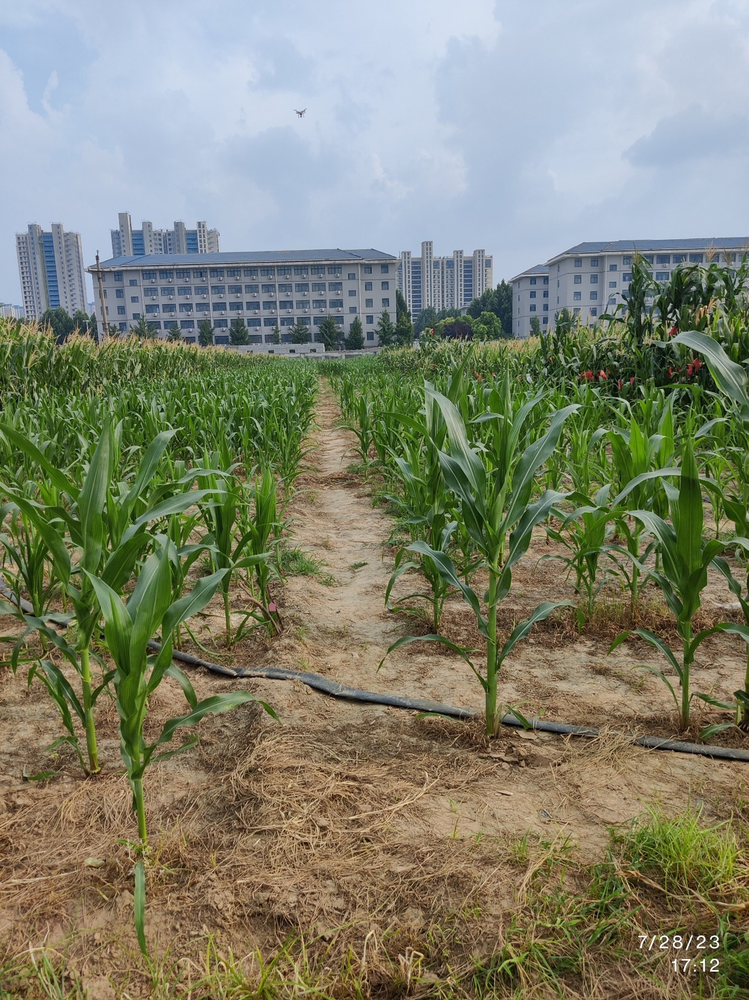

The Robotics and AI Research Lab (RARL) has developed a UAV-based maize image dataset named **CMW**, available at: [https://doi.org/10.5281/zenodo.16741468](https://doi.org/10.5281/zenodo.16741468).  

This dataset was utilized in our recent publication:  
**A. Jahangir Moshayedi et al., "Smart Farming Solutions: A User-Friendly GUI for Maize Tassel Estimation Using YOLO With Dynamic and Fixed Labelling, Featuring Video Support," IEEE Access, vol. 13, pp. 57809–57833, 2025, doi: 10.1109/ACCESS.2025.3554984**  

### Dataset Structure  
The **CMW dataset** is organized into the following main folders:  

1. **Image Source (CMW_DATASET_Imagesource)**  
   • CMW_DATASET01_Imagesource: Images 1–160  
   • CMW_DATASET02_Imagesource: Images 1–370  

2. **Labels (CMW_DATASET_label)**  
   • CMW_DATASET_Dynamic_labels  
   • CMW_DATASET_fixsize_labels  
   • CMW_DATASET_images  

3. **Image Specifications (Imagedata1_specification)**  
   Each image folder contains:  
   1. image_CannyEdges  
   2. image_Equalized_Grayscale_Histogram  
   3. image_Equalized_RGB_Channels_Histogram  
   4. image_Grayscale_Histogram  
   5. image_Hue_Histogram  
   6. image_Original_vs_Blurred  
   7. image_Original_Histogram  
   8. image_PixelIntensity_RowVariation  
   9. image_RedChannel_Heatmap  
   10. image_report  
   11. image_RGB_Histogram  
   12. image_Saturation_Histogram  
   13. image_Value_Histogram  
   14. image_Value_Intensity_RowVariation  

4. **Numerical Image Analysis Report (text file for each image):**  
   • Resolution, Width (4096 px), Height (2160 px), Total Pixels (8,847,360)  
   • Number of Channels, Pixel Mean & Std Dev (R, G, B)  
   • Red, Green, Blue Channel Mean & Std Dev  
   • Grayscale Mean & Std Dev  
   • Hue, Saturation, Value Mean & Std Dev  
   • Blurred Image Mean & Std Dev (RGB average)  

5. **Dataset Comparison (002.Compare dataset)**  
   • MSE plots: dataset1 vs MTDC, dataset2 vs MTDC, dataset1 vs dataset2  
   • PSNR plots: dataset1 vs MTDC, dataset2 vs MTDC, dataset1 vs dataset2  
   • SSIM plots: dataset1 vs MTDC, dataset2 vs MTDC, dataset1 vs dataset2  

This structured dataset provides high-resolution UAV imagery and detailed analysis to support advanced research in **precision agriculture, machine vision, and maize tassel estimation**.  

  

  

  

  

  
