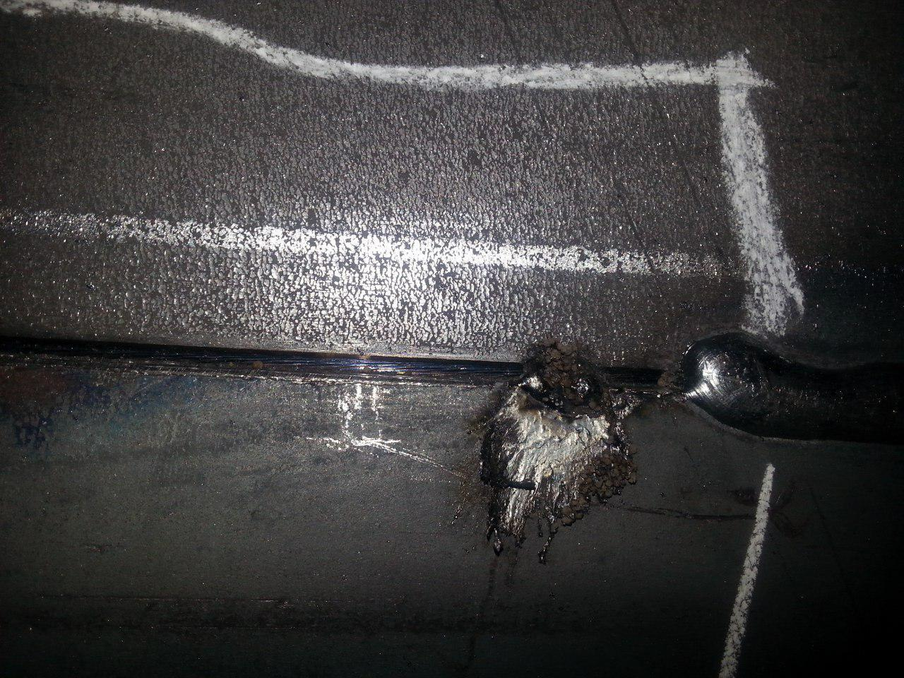
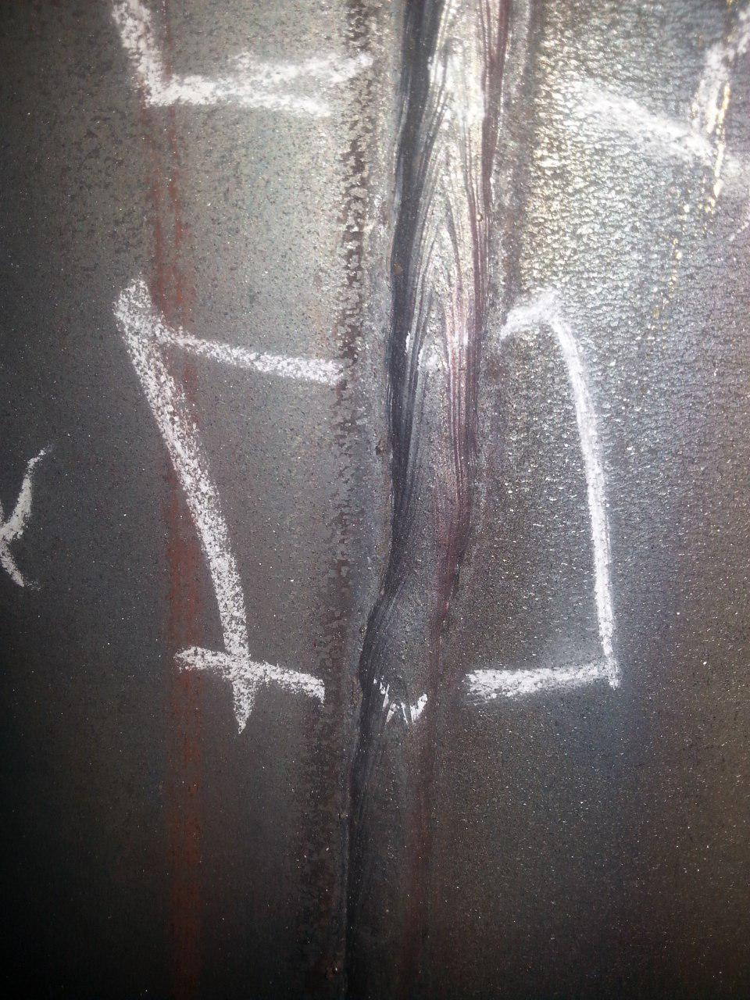
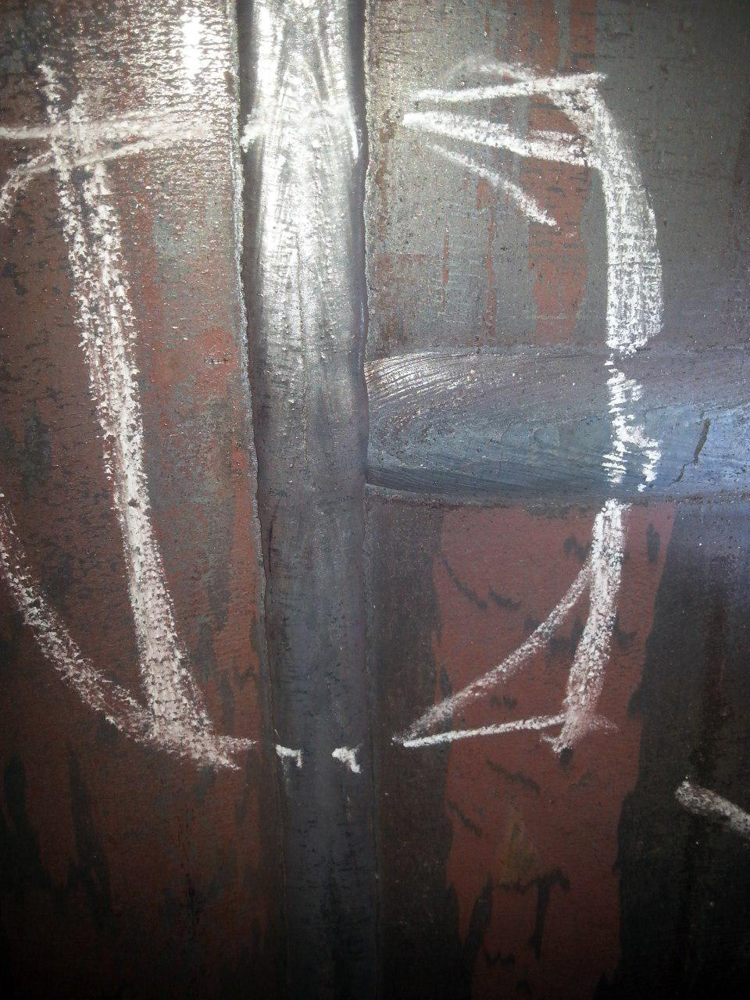

The Robotics and AI Research Lab (RARL) has developed a comprehensive **Pipe Welding Defect Image Dataset (PWDID)**, available at: [https://zenodo.org/records/16935930](https://zenodo.org/records/16935930).  

Welding quality is a critical factor in the safety, durability, and performance of industrial piping systems. Defects such as cracks, porosity, overlap, undercut, holes, corrosion, and general welding imperfections can compromise structural integrity, leading to costly repairs, safety hazards, and operational downtime. Traditionally, defect detection relies on manual inspection, which is time-consuming, prone to human error, and inconsistent across inspectors. With the advancement of computer vision and machine learning techniques, automated welding defect detection has emerged as a promising solution. However, the development and evaluation of such algorithms require robust and representative image datasets that capture real-world variations in defects, lighting conditions, surface textures, and welding types.  

### Dataset Overview  
The **PWDID dataset** consists of **78 high-resolution images** captured from the pipe welding industry using a standard camera. Each image documents specific welding defects commonly encountered in industrial pipe fabrication.  

The dataset includes the following defect categories:  
- **Overlap**  
- **Under Cut**  
- **Welding Defects**  
- **Corrosion**  
- **Cracks**  
- **Holes**  
- **Porosity**  

This collection provides a diverse representation of welding imperfections, enabling researchers and engineers to develop and evaluate automated inspection, defect detection, and quality control algorithms for pipe welding applications. By providing labeled examples of various defect types, **PWDID** serves as a valuable resource for designing, training, and benchmarking intelligent inspection systems, ultimately contributing to safer, more reliable, and higher-quality industrial operations.  

### Publications Using PWDID  
Parts of this dataset have been utilized in the following publications:  

1. **Moshayedi, A. J., Khan, A. S., Yang, S., & Zanjani, S. M. (2022, April).**  
*Personal image classifier based handy pipe defect recognizer (HPD): design and test.* In *2022 7th International Conference on Intelligent Computing and Signal Processing (ICSP)* (pp. 1721–1728). IEEE.  

2. **Moshayedi, A. J., Nowzari, R., Taherinezhad, M., Esmaeili Najafabadi, H., Khan, A. S., Ghadiri Nejad, M., & Ghanbari, N. (2025).**  
*Investigation and Characterization of Pipe Defects and Techniques, and Challenges Toward the Protection of Environmental Protection.* Iranian Journal of Chemistry and Chemical Engineering, 44(6), 1724–1756.  

3. **Moshayedi, A. J., Khan, A. S., Khan, Z. H., & Zhang, X. (2025).**  
*Safeguarding smart infrastructure: A review of deep learning techniques for automatic pipeline defect detection.* Empowering AI Applications in Smart Life and Environment, 67–92.  

This structured dataset provides a strong foundation for research in **automated welding defect detection, industrial safety, and machine vision for quality control**.  

  

  

  

